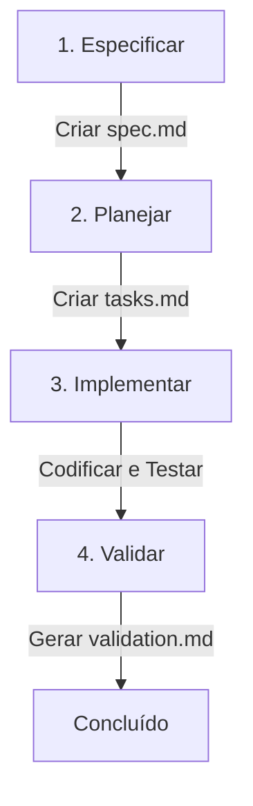

# Spec-Driven Development (SDD) - ScaleFlow

Bem-vindo à estrutura de **Spec-Driven Development (SDD)** do ScaleFlow. Este diretório centraliza todas as especificações funcionais, planos técnicos de implementação e validações do projeto, garantindo que o desenvolvimento (seja por humanos ou agentes de IA) seja guiado por intenções claras e regras de arquitetura bem definidas, em vez de implementações impulsivas.

## 📂 Estrutura do Diretório `/specs`

O diretório `/specs` é estruturado da seguinte forma:

```text
specs/
├── README.md                 # Este documento explicativo
├── constitution.md           # Regras de arquitetura, estilos e diretrizes do projeto
├── templates/
│   ├── spec-template.md      # Template para novas especificações funcionais
│   ├── tasks-template.md     # Template para planos de tarefas técnicas
│   └── validation-template.md # Template para planos de validação e testes
└── [ID]-spec-[feature-name]/ # Exemplo de diretório para uma funcionalidade
    ├── spec.md               # Especificação funcional da feature
    ├── tasks.md              # Lista de tarefas técnicas passo a passo
    └── validation.md         # Relatório de testes e validação
```

## 🔄 Fluxo de Desenvolvimento SDD

O desenvolvimento de qualquer nova funcionalidade ou correção complexa segue quatro etapas estruturadas:



1. **Especificar (O que fazer):** Cria-se uma pasta `[ID]-spec-[feature-name]/` e, usando o `spec-template.md`, define-se os objetivos, requisitos de negócio, critérios de aceitação e restrições.
2. **Planejar (Como fazer):** Usando o `tasks-template.md`, detalha-se a arquitetura, as alterações de arquivos necessárias, modelo de dados e a sequência passo a passo de tarefas.
3. **Implementar (Fazer):** O código é escrito seguindo estritamente as tarefas descritas e respeitando a [Constituição do Projeto](file:///f:/Developer_Area_f/me/projects/ScaleFlow/specs/constitution.md).
4. **Validar (Garantir que funciona):** Utiliza-se o `validation-template.md` para testar manual e automaticamente a funcionalidade e garantir que nenhum efeito colateral foi introduzido.

## 🚀 Como usar essa estrutura no dia a dia

1. **Nova Feature:** Crie uma pasta dentro de `/specs` com o formato `[ID]-spec-[nome-da-feature]` (ex: `01-spec-cadastro-servo`).
2. **Copie os Templates:** Crie três arquivos dentro dessa pasta:
   - `spec.md` (copiado de `spec-template.md`)
   - `tasks.md` (copiado de `tasks-template.md`)
   - `validation.md` (copiado de `validation-template.md`)
3. **Preencha e Valide:** Preencha o `spec.md` e o `tasks.md` antes de começar a codificar. Ao terminar a implementação, execute a validação e preencha o `validation.md`.

---
Para começar, leia a [Constituição do Projeto](file:///f:/Developer_Area_f/me/projects/ScaleFlow/specs/constitution.md) para entender os princípios técnicos.
